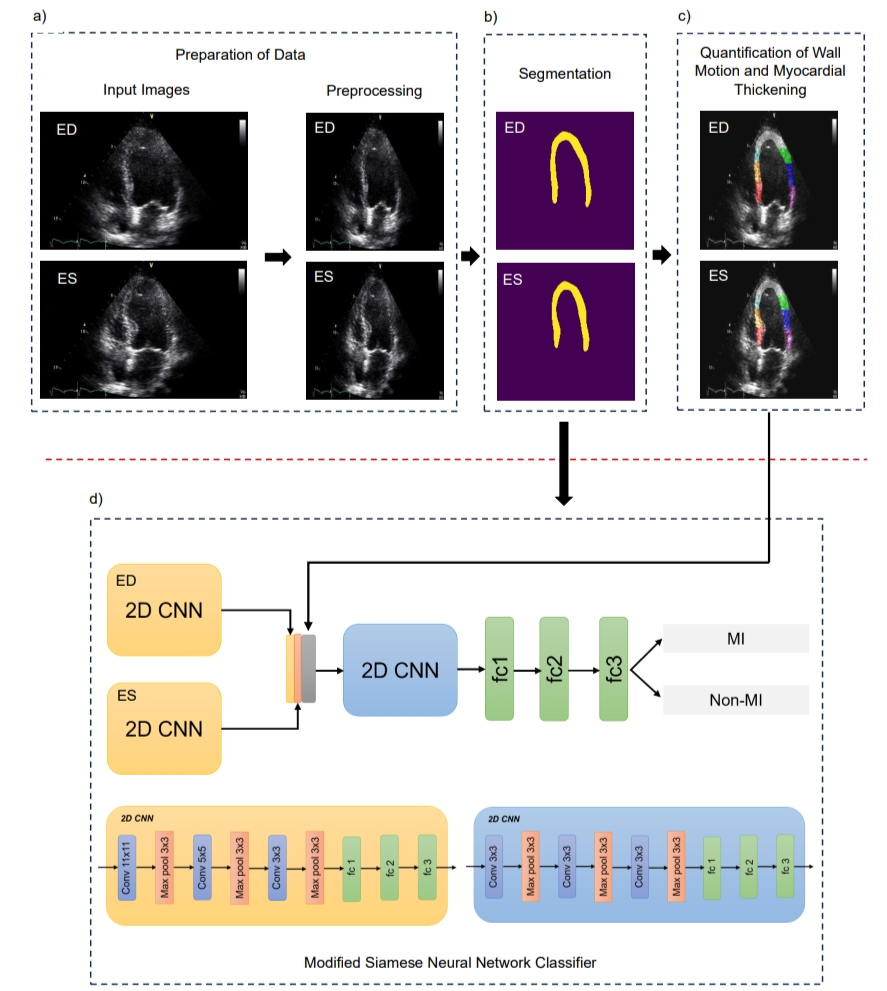

# MI-Detection
This code detects Myocardial Infarction (heart attack) from echocardiograms (echo) or magnetic resonance images (MRI).
The method contains three main parts:

1. **Image Segmentation using U-Net:**
   - A U-Net model performs image segmentation. Given an input echo or MRI image, the U-Net predicts pixel-wise masks that highlight the myocardium.
   - These masks help identify the boundaries of the heart tissue, which is crucial for subsequent analysis.

2. **Quantification of Wall Motion and Myocardial Thickening:**
   - From the predicted masks, information on cardiac wall motion and myocardial thickening are extracted.
   - Wall motion refers to the movement of the heart walls during the cardiac cycle. It can be quantified by analyzing how the myocardium contracts and expands.
   - Myocardial thickening measures the change in thickness of the heart muscle during contraction and relaxation.

3. **Binary Classification using Modified Siamese Neural Network:**
   - The quantified wall motion and myocardial thickening features, along with the generated masks, are fed into a binary classifier.
   - The classifier is based on a modified Siamese neural network architecture.
   - The goal of this is to determine whether the patient has experienced a heart attack (Myocardial Infarction) based on the combined information from the segmentation and quantification steps.

The code combines image segmentation, feature extraction, and binary classification to detect heart attacks from echo or MRI data. It's a comprehensive approach that leverages both structural information (from the masks) and functional information (from wall motion and myocardial thickening) to detect heart attacks.

To run this project, install the following dependencies:

    numpy,    
    seaborn, 
    os, 
    shutil, 
    pandas, 
    torchvision, 
    matplotlib, 
    scikit-skimage, 
    scikit-learn, 
    natsort, 
    visdom, 
    opencv, 
    tensorflow, 
    SimpleITK, 
    nibabel, 
    python-polylabel, 
    openpyxl

The project consists of two major repositories:
1. notebook - contains jupyter notebooks detailing data preprocessing, training, and evaluation of echo dataset and MRI dataset
2. src - contains python source codes for the U-Net, quantification of wall motion and myocardial thickening, and modified Siamese Neural Network implementations

Set the location of dataset and folders first in the following:

  src/midetection/Utils/echo_config.py
  
  src/midetection/Utils/mri_config.py
  
  src/midetection/lib/siamese_net/config.py 

References:

[1] Malav Bateriwala, & Pierrick Bourgeat (2019). Enforcing temporal consistency in Deep Learning segmentation of brain MR images. CoRR, abs/1906.07160.

[2] Benhur, S. (2022, June 5). A friendly Introduction to Siamese Networks. Medium. https://towardsdatascience.com/a-friendly-introduction-to-siamese-networks-85ab17522942

[3] HMC-QU Dataset. (n.d.). Retrieved May 12, 2024, from https://www.kaggle.com/datasets/aysendegerli/hmcqu-dataset

[4] Christos Sakaridis, Dengxin Dai, and Luc Van Gool. "ACDC: The Adverse Conditions Dataset with Correspondences for Semantic Driving Scene Understanding". Proceedings of the IEEE/CVF International Conference on Computer Vision (ICCV), 2021.
